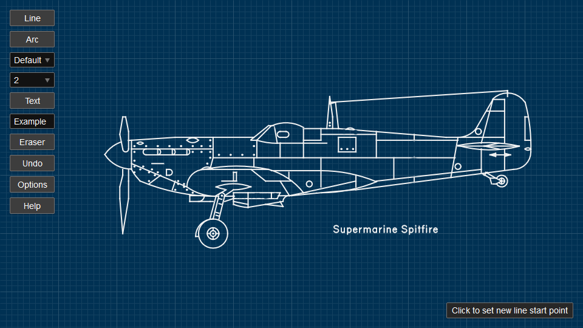

# Really Sketch

Simple online graph paper with basic drafting tools. [View it live](https://reallysketch.com/).

Javascript source is in `src/` and uses [rollup.js](https://rollupjs.org/guide/en/) to bundle into `site/assets/js/bundle.min.js`.

Website is in `site/` and is built with [Hugo](https://gohugo.io/) into `dist/` including minified javascript bundle.

Deployed to [netlify](https://app.netlify.com/sites/reallysketch/deploys).

## Local Development

Clone the repo and then `npm install`.

`npm run serve` to run locally.

`npm run build` to output to `dist/`.

## Kudos

[Routed Gothic Font](https://github.com/dse/routed-gothic)

[Colors](https://clrs.cc/)
